# Om mig: Min Resa

## Hero-sektion (Intro)
Denna bild ska ligga allra överst på sidan som en stor, välkomnande header-bild innan sektionerna börjar. 

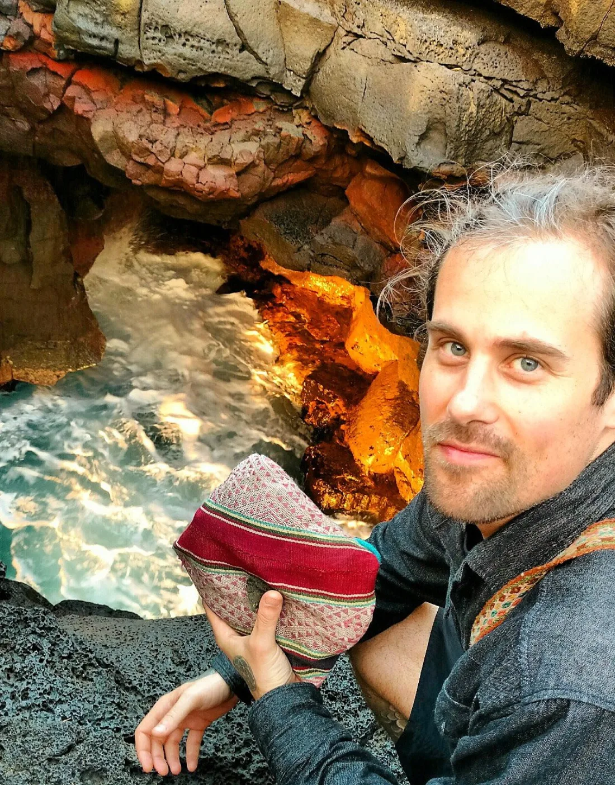

---

## Innehållsförteckning / Sidstruktur
1. Barndomens skapande och mystik
2. Sökandet efter något mer
3. Från psykedelika till mysticism
4. Arbetsliv och tidiga erfarenheter
5. Klädbranschen och konsten
6. Första steget in i tatueringsvärlden
7. Lärande i studion
8. Min stil tar form
9. Andlig utveckling och mentorskap
10. Expansion på Hawaii
11. USA och Kanada – kontraster och lärdomar
12. Prövningar och relationer
13. Tredje studion i Stockholm
14. Måleriet och den konstnärliga glöden
15. Resor till USA – Los Angeles och Utah
16. Tillbaka i Sverige – en lugnare studio
17. Astrologi och vedisk visdom
18. Resor till Barcelona och Bali
19. Steget mot egen studio
20. Studio ADharma – min plattform
21. Framåt

---

## 1. Barndomens skapande och mystik

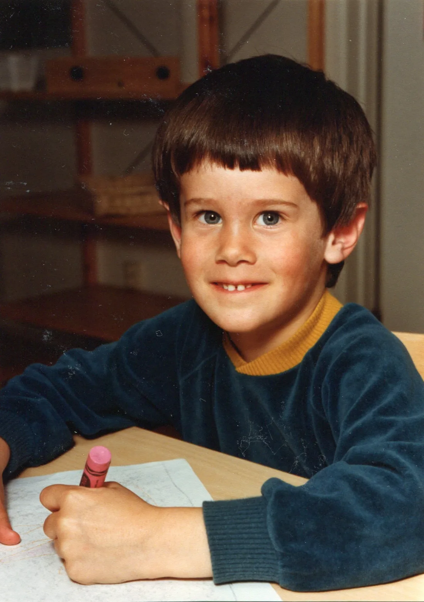

Som barn älskade jag att ritade och kunde sitta i timmar. Skapandet har sedan dess kommit i olika faser, mer eller mindre intensivt, men alltid funnits där som en del av mig.

Redan tidigt försökte jag fånga mina visioner och drömmar i bilder – mitt uttryck har sedan barnsben varit det visuella.

Intresset för mystik och det fördolda har alltid stått i centrum. Jag bar tidigt på djupa frågeställningar och en nyfikenhet som sträckte sig bortom den materiella världen.

Återkommande upplevelser där jag skiftade i tillstånd och medvetenhet präglade min barndom. Många av mina minnen består av drömmar och händelser som varit svåra att sätta ord på, men som fascinerade mig och la grunden för min utveckling – både som människa och som blivande tatuerare.

---

## 2. Sökandet efter något mer

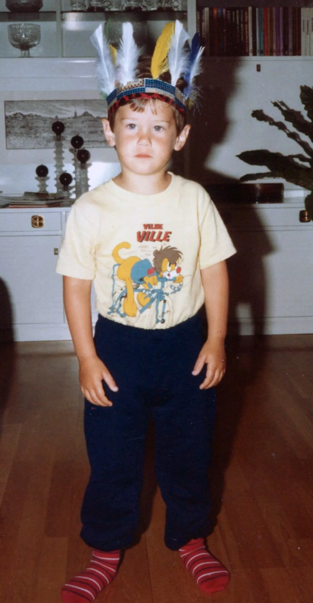

Hungrig på att uppleva mer av det mystiska växte mitt intresse för allt som kunde erbjuda en lösning – en väg ut ur ekorrhjulet. Sökandet efter både världens och min egen frigörelse började tidigt och tog sig många olika uttryck genom åren.

Jag har alltid varit en rebell, trotsat rådande narrativ och haft svårt att acceptera samhällets formatering. Efter en stökig och rastlös tid i tonåren gick jag igenom djupa faser av uppvaknande.

Min fortsatta utveckling fick en skjuts genom psykedeliska erfarenheter, där min oskuldsfulla natur lade grunden för upplevelser av total transformation och gränslös kärlek. Dessa insikter satte tonen för mitt liv och inspirerar mig än idag.

---

## 3. Från psykedelika till mysticism

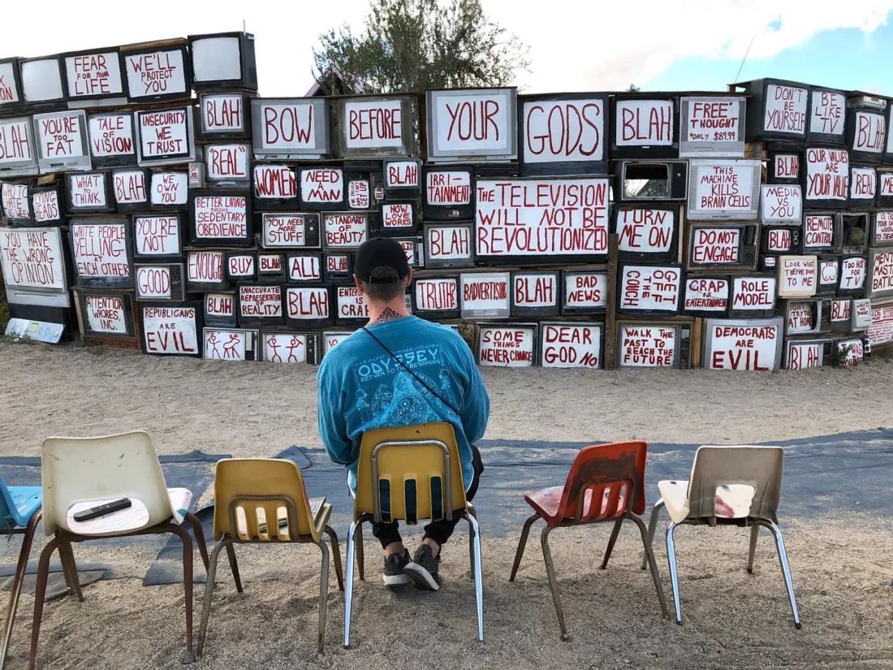

Med en djupare förståelse för livet och en insikt om nödvändig förändring drogs jag bort från den förtrollade världen av psykedelika och mot shamanism och mysticism. Här fann jag den struktur jag sökte, och mitt lärande gick in i en ny fas.

Till min stora tacksamhet kom olika äldre kvinnor in i mitt liv på naturliga sätt, och de blev viktiga vägledare i min strävan efter djupare sanningar och förståelse. Med tiden mognade min syn, mina prioriteringar skiftade och lärandet fördjupades ytterligare.

---

## 4. Arbetsliv och tidiga erfarenheter

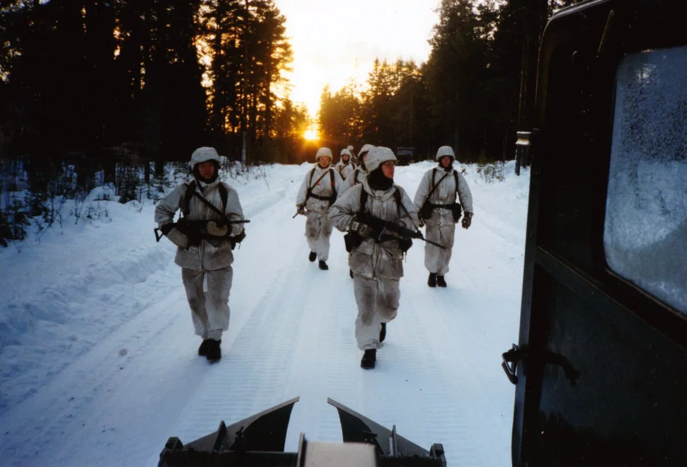

Parallellt med min andliga utveckling och intresset för mysticism hann jag arbeta inom flera olika områden innan jag hittade hem som tatuerare.

Efter gymnasiet gjorde jag militärtjänst i Boden – en välkommen chans att lämna förorten där jag vuxit upp. Jag hade känt mig instängd, rastlös och ostimulerad, lumpen gav mig nya perspektiv och struktur.

Under den tiden började jag uppleva kraftfulla energipåslag i tillståndet mellan vaket och sömn. Det var som elektriska vågor som sköljde genom kroppen, först skrämmande och snart något jag lärde mig att slappna av i och njuta av. Dessa upplevelser präglade mig djupt under sensommaren vid Lule älv 1999.

Efter sju och en halv månad i lumpen halkade jag in i krogbranschen – först som diskare i Sälen och "nisse" i Smögen, senare som servitör och bartender i Oslo. Som belöning efter ett intensivt år i Oslos krogvärld gav jag mig ut på min första långresa till Sydostasien och Nya Zeeland. Backpackingdrömmen blev verklighet, och spänningen och friheten var precis så underbar som jag hade föreställt mig.

Efter hemkomsten började jag arbeta på flera etablerade krogar och nattklubbar i Stockholm, innan jag så småningom sadlade om och gick in i klädbranschen.

---

## 5. Klädbranschen och konsten

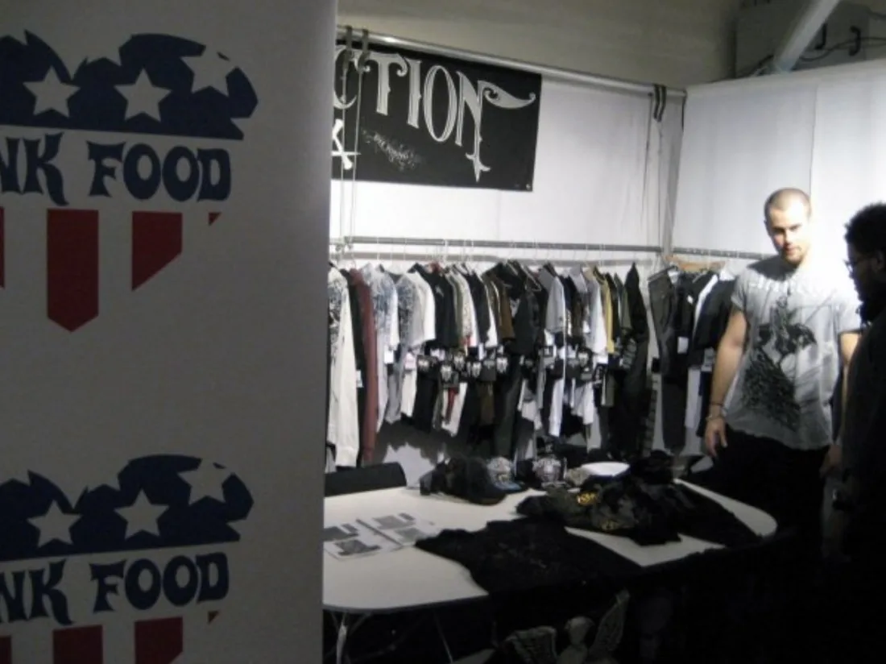

Innan dess hann jag med två terminer på folkhögskola där jag studerade konst. Längtan efter att uttrycka mig visuellt och utveckla min talang var stark. När en ansökan till Nyckelviken inte gick vägen mötte jag en vän som också lämnat Smögens och Oslos krogvärld bakom sig.

Hans nystartade kläddistribution behövde stöd, och vår vänskap och tidigare jobberfarenhet utvecklades till flera intensiva år i branschen. Vi etablerade bland annat amerikansk streetwear i Skandinavien, reste till mässor i Köpenhamn, Berlin och Barcelona. Vi var även i Los Angeles och Las Vegas vid några tillfällen.

Efter några år startade jag min egen klädagentur. Trots erfarenhet och en gedigen kundkrets växte känslan av motstånd. Insikten kom allt tydligare: jag var på fel plats, och något annat väntade på mig.

---

## 6. Första steget in i tatueringsvärlden

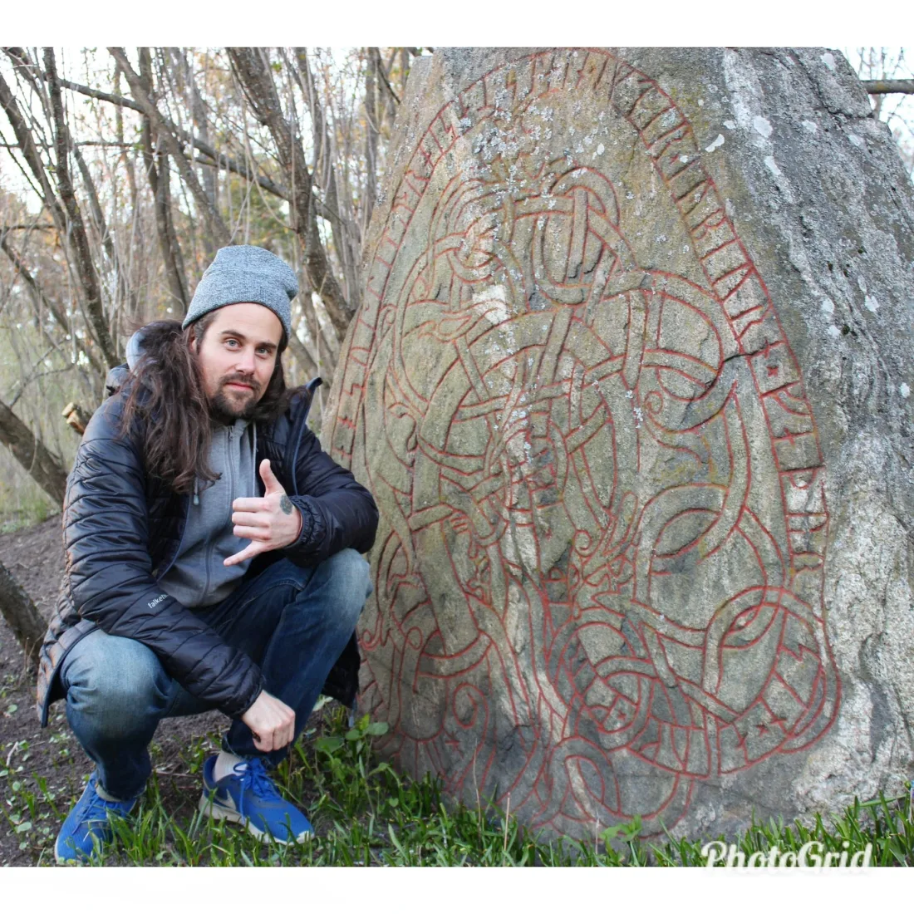

Väl hemma från en tre veckor lång djupdykning i andinsk mysticism i Peru 2012 fanns det ingen återvändo. Jag insåg att det var dags att ta klivet och satsa på en sedan länge slumrande dröm – att bli tatuerare.

Jag kände redan några människor i branschen och hade hjälpt en studio i området genom mina klädkontakter. Vid ett tillfälle hade jag nämnt att jag ville lära mig hantverket på riktigt.

Tidigare hade jag tatuerat sporadiskt, hemma och i olika miljöer, men utan större framgång – framför allt på grund av brist på vägledning och rätt utrustning.

Jag bestämde mig för att avsluta samarbetet med det sista varumärket och besökte tatueringsstudion på hemmaplan.

Tajmingen var enastående. Dagen innan hade ägaren gjort sig av med både receptionisten och en tatuerare – och han frågade mig om jag kunde börja direkt. När jag insåg att möjligheten var min, att få lära mig i en etablerad studio med flera tatuerare, kändes det som att jag hade kommit hem. En helt ny fas i mitt liv öppnade sig.

Lycklig och tacksam tog jag mig an ansvaret i studion: kunder, bokningar, ärenden, städning och rengöring av alla grepp som tatuerarna använde i det dagliga arbetet.

---

## 7. Lärande i studion

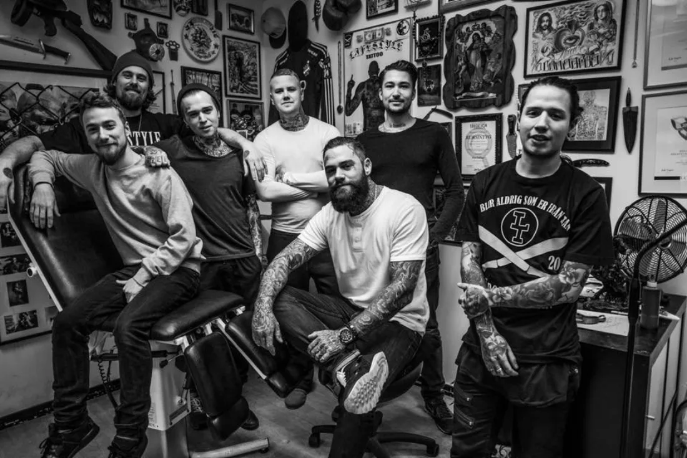

På den tiden användes fortfarande coil-maskiner och stålgrepp, som rengjordes inför autoklavens dagliga sterilisering. Engångsgrepp och nålkassetter hade ännu inte slagit igenom.

Det var upp till mig att lära mig yrket. Jag var aldrig någon traditionell lärling – ansvaret låg helt på mig, min hunger och min vilja att lära mig att tatuera.

Så fort det fanns en lucka var jag där, frågade, observerade och studerade mina kollegors hantverk. När tiden var mogen fick jag börja tatuera på kvällar och helger. Allting flöt på, jag var motiverad och lärde mig snabbt värdet av närvaro och fokus i processen.

Efter ett och ett halvt år av konstant arbete började jag känna mig sliten och nedgången. Men jag minns tydligt känslan när ägaren kom till mig med det efterlängtade beskedet: att jag nu hade vad som krävdes för att få min egen plats i studion och hyra en stol som yrkesverksam tatuerare.

---

## 8. Min stil tar form

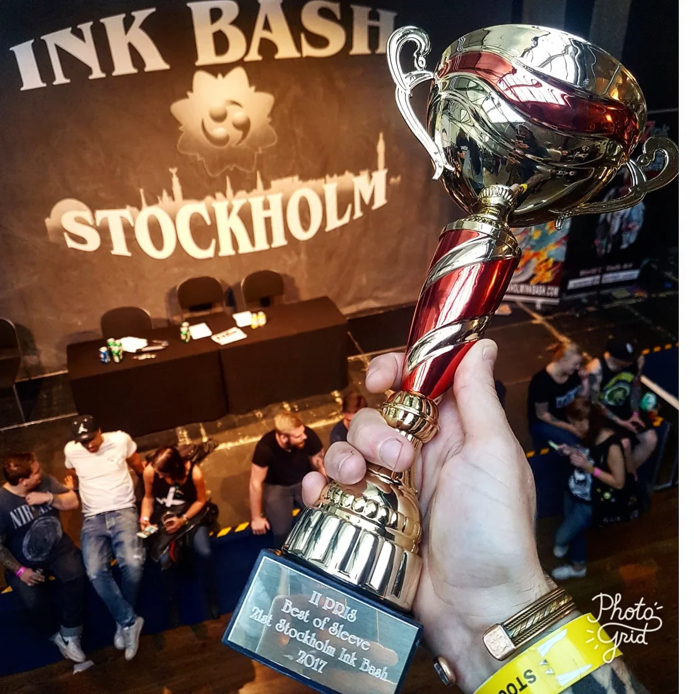

Som barn ritade jag teckningar som alla barn gör, men i slutet av tonåren förändrades mitt uttryck. Skapandet med penna på papper drogs mer och mer mot mönster och tydliga former.

När jag sedan började tatuera blev det en självklarhet att låta den geometriska tatueringsstilen med mandalas, ornament och kraftfull symbolik bli min fördjupning. Den beskrev det ursprungliga sökandet efter perfektion och större ordning – något som har drivit oss människor i alla tider.

---

## 9. Andlig utveckling och mentorskap

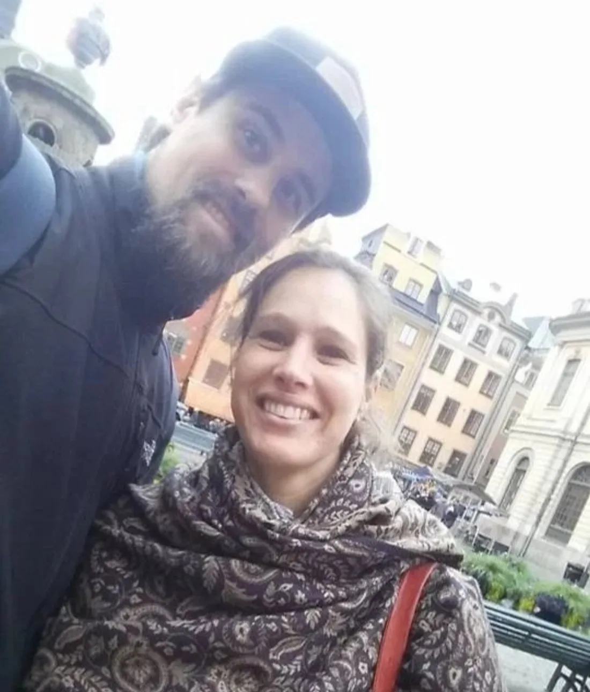

Under mina fyra och ett halvt år i studion på hemmaplan fortsatte jag att expandera och utvecklas. Ännu fler äldre, både män och kvinnor, kom in i mitt liv och hjälpte mig att navigera och förstå mig själv på ett djupare plan.

Deras omsorg, vägledning och omhändertagande öppnade dörrar inom mig och gav mig tillgång till mer av min kraft. Djupare sidor av mig själv började vakna till liv.

Upplevelserna var förbryllande, men samtidigt självklara. Begrepp som tidigare liv och själsfränder fick en helt ny innebörd när fler och fler pusselbitar föll på plats. Jag befann mig i ett tillstånd av bliss och flow – allt kändes lätt, och livet lekte.

---

## 10. Expansion på Hawaii

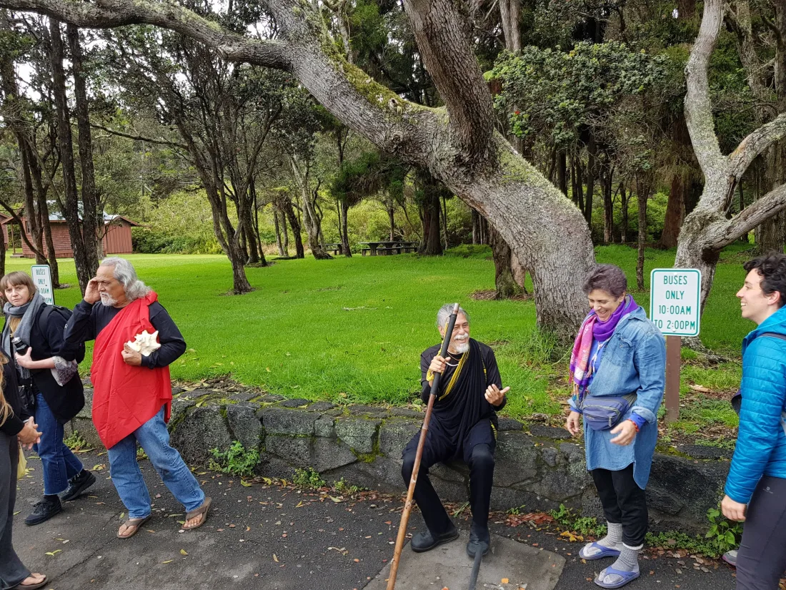

Full av mening och sammanhang stod jag kvar på surfbrädan, och navigerade i de harmoniska vågor som förde mig framåt i livet. Som ett barn med begränsad erfarenhet trodde jag naivt att detta var en form av fullkomlighet – men ack, så fel jag skulle visa mig ha.

Mitt behov av expansion gjorde sig ännu en gång påmint, och min tid i studion var över. Sökandet tog mig vidare till Hawaii, där ännu fler pusselbitar och själsliga kopplingar landade under mina fyrtiofyra dagar på Ailani Orchard.

Här blandades lärande om ekologiskt jordbruk och permakultur med ceremoniellt arbete på polynesiska kraftplatser. Den stora ön levererade.

Upplevelsen på Hawaii markerade slutet på en cykel och början på en ny. Här kulminerade lycksaligheten.

Omsluten av den vilda naturen fick jag möta mina rädslor, smaka på kraften, förundras över livets mysterier och ta emot välsignelsen från de gamla gudarna och gudinnorna i den polynesiska övärlden.

Hungern för djupare initiering och kopplingen till Hawaii tog mig tillbaka något år senare.

---

## 11. USA och Kanada – kontraster och lärdomar
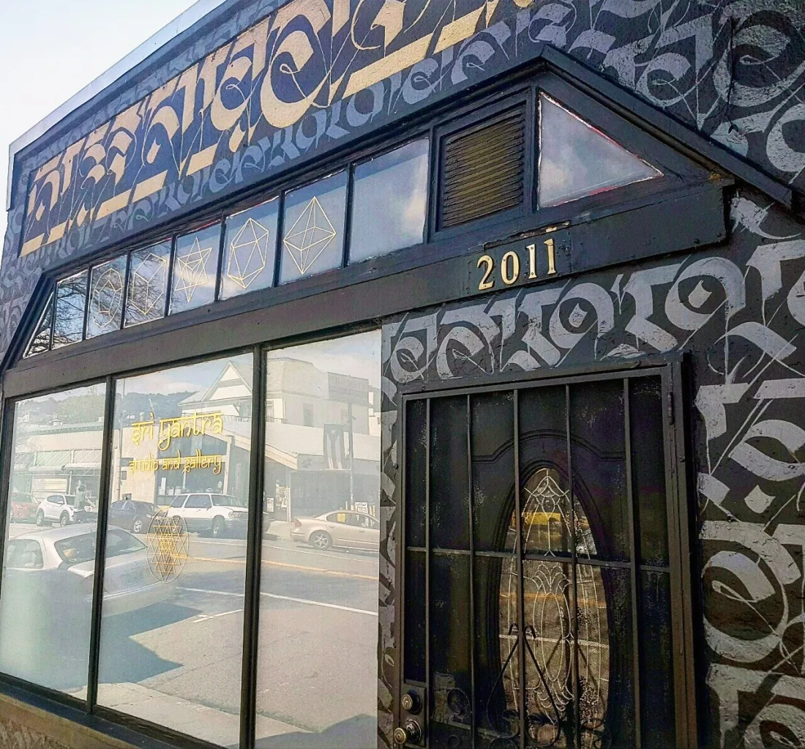

Påfylld som aldrig förr fortsatte min resa till Oakland, där jag bodde och arbetade med en av pionjärerna inom geometrisk tatuering.

Det var en total omställning – från den mjuka, feminina kraften på Hawaii till ett mentalt hyperfokus där pengar och status betydde allt. Sociala medier och andras åsikter vägde tungt och styrde prioriteringarna i en ytlig värld av materiellt överflöd.

Trots kontrasten lyckades jag hålla fötterna på jorden och tog med mig värdefulla upplevelser och lärdomar även härifrån. Resan fortsatte, och efter två veckor i USA landade jag i Vancouver, Kanada.

Här stannade jag några veckor och tatuerade från en studio mitt i stan. Tack vare en vänskap från Hawaii fick jag uppleva landet inifrån och återkom regelbundet till Kanada under de kommande två åren. Magiska naturupplevelser och autentiska svetthyddor blandades med tatueringsjobb från studion i downtown Vancouver.

---

## 12. Prövningar och relationer

*(Sektion saknas i källmaterialet – lägg till innehåll här)*

---

## 13. Tredje studion i Stockholm
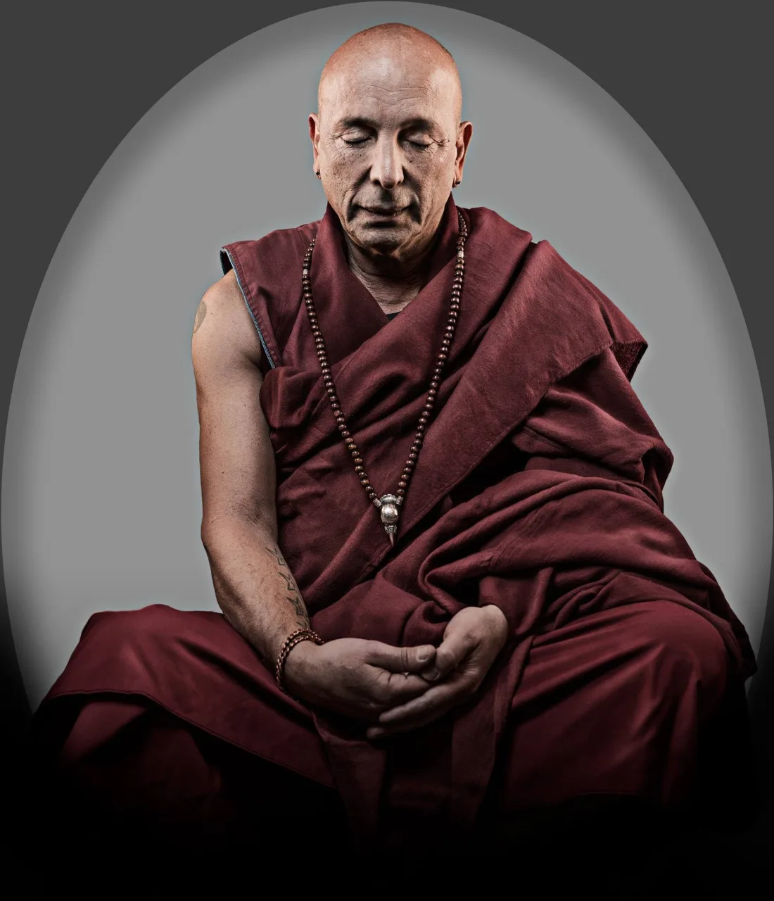

Vid det här laget arbetade jag i min tredje studio i Stockholm. Även här mötte jag utmaningar som tog på krafterna, triggade rädslor och rörde runt i mitt inre bagage. Tacksam över vägledningen och stödet från min senaste mentor lyckades jag navigera och ta mig igenom prövningarna som hopade sig.

I behov av handfasta verktyg för balans och återhämtning började jag meditera dagligen. Det hjälpte mig att sänka stressen och bli lugnare.

Samtidigt kändes det som att alla healing-sessioner, allt energiarbete och alla shamanska upplevelser inte riktigt gav mig det jag sökte. Jag hade lärt känna mig själv bättre, fått höra magiska berättelser om min kraft, min härkomst och mitt arv – men hur mådde jag egentligen?

Speglingar i vardagen och från min mentor visade mig att jag hade långt kvar på resan. Jag fortsatte att stötta andra i deras utveckling och gav av både min tid och mitt engagemang.

Återhämtning och begränsning hade ofta varit ledord i den vägledning jag tagit emot. Det var lätt att förstå, men svårt att leva upp till i praktiken. Ännu en gång insåg jag att jag var klar i studion där jag arbetat de senaste tre och ett halvt åren.

---

## 14. Måleriet och den konstnärliga glöden

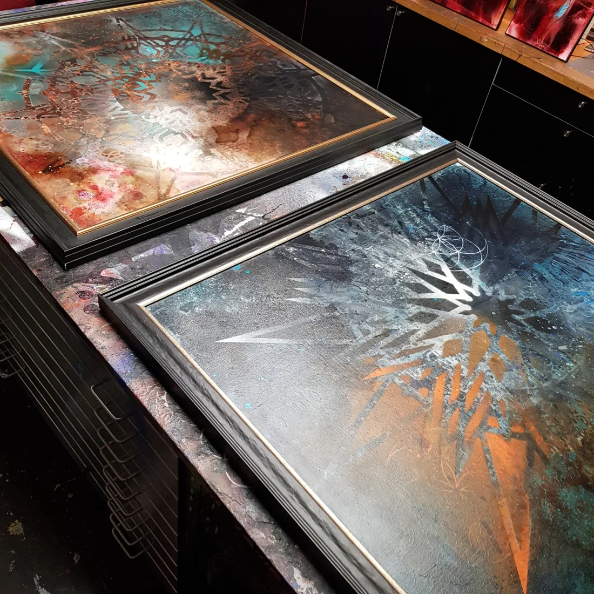

Under den här perioden hade jag också turen att få måla tavlor tillsammans med en yrkesverksam konstnär, som generöst delade med sig av materialkunskap, tekniker och tillvägagångssätt.

Hans abstrakta stil öppnade dörrar för mitt eget skapande, och jag hann med två kollektioner på totalt fem tavlor på linneduk. Några gav jag bort, några sålde jag, och några behöll jag själv. Drömmen om att måla blossade upp och brinner fortfarande, trots flera års uppehåll.

---

## 15. Resor till USA – Los Angeles och Utah

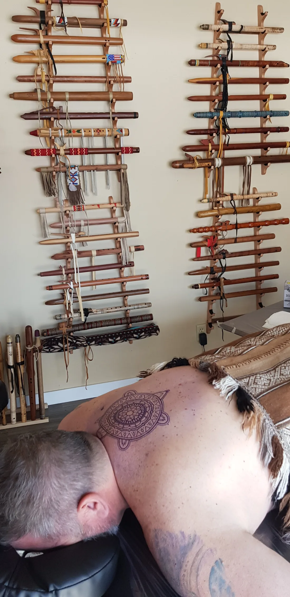

Tack vare en vän från mina tidiga år i branschen fick jag möjligheten att återvända till Los Angeles för andra gången. Den första resan hade jag gjort tillsammans med hela studion.

Med fina upplevelser färskt i minnet – och ett starkt behov av att bryta mig loss från vardagen – tog jag emot inbjudan, packade väskan och reste iväg.

Med ett expanderande nätverk av både vänner och kunder från USA och Kanada blev det en perfekt mix av nytta och nöje. Jag reste även till Utah för att hälsa på en ny vän jag lärt känna under min andra resa till Hawaii.

Bland berg och storslagen natur fick jag uppleva en helt annan värld än den i L.A. Utöver tatuerandet hade jag turen att få delta i en autentisk Lakota-svetthydda, där jag mötte kloka och jordnära kvinnor, dedikerade att föra den gamla visdomen vidare.

Min vän, som tog emot mig i Utah, arbetade med livstidsdömda fångar och erbjöd även svetthyddor på anstalten. Full av beundran och tagen av hans engagemang fick jag äran att tatuera in symbolen för hans namn på Lakota – "Keya Sapa".

Jag hann precis ta mig hem innan USA stängde sina gränser, när Covid slog till med full kraft över världen.

---

## 16. Tillbaka i Sverige – en lugnare studio

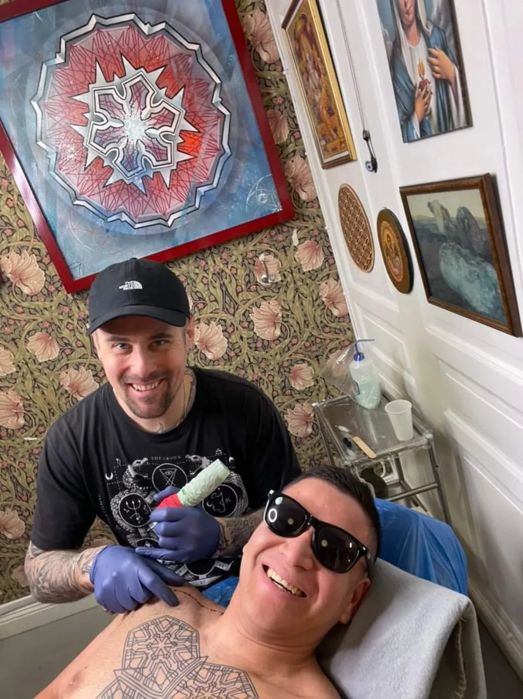
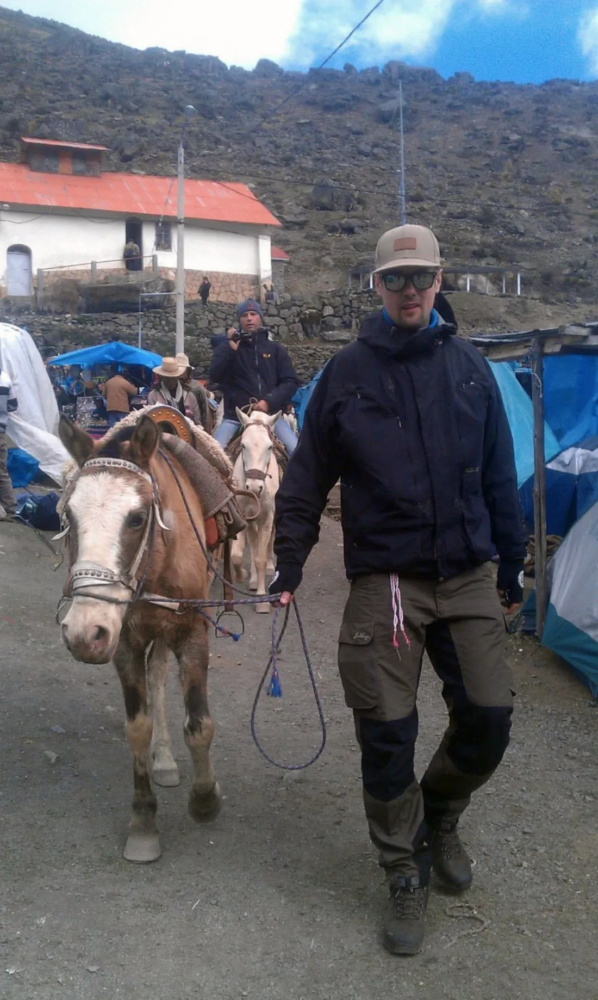

Väl hemma från resan kände jag mig ännu en gång klar i den studiomiljö där jag arbetat de senaste åren. Det var dags att ta nästa steg, och visionen om en egen plats började ta form.

Jag sökte några lokaler, men tiden var inte inne. Istället öppnades dörrarna till en lugn och harmonisk studio med färre kollegor och mindre spring.

Här fick jag äntligen landa och återhämta mig efter flera år i turbulenta miljöer. Lugnet i studion och ägarens personlighet var som en skänk från ovan.

---

## 17. Astrologi och vedisk visdom

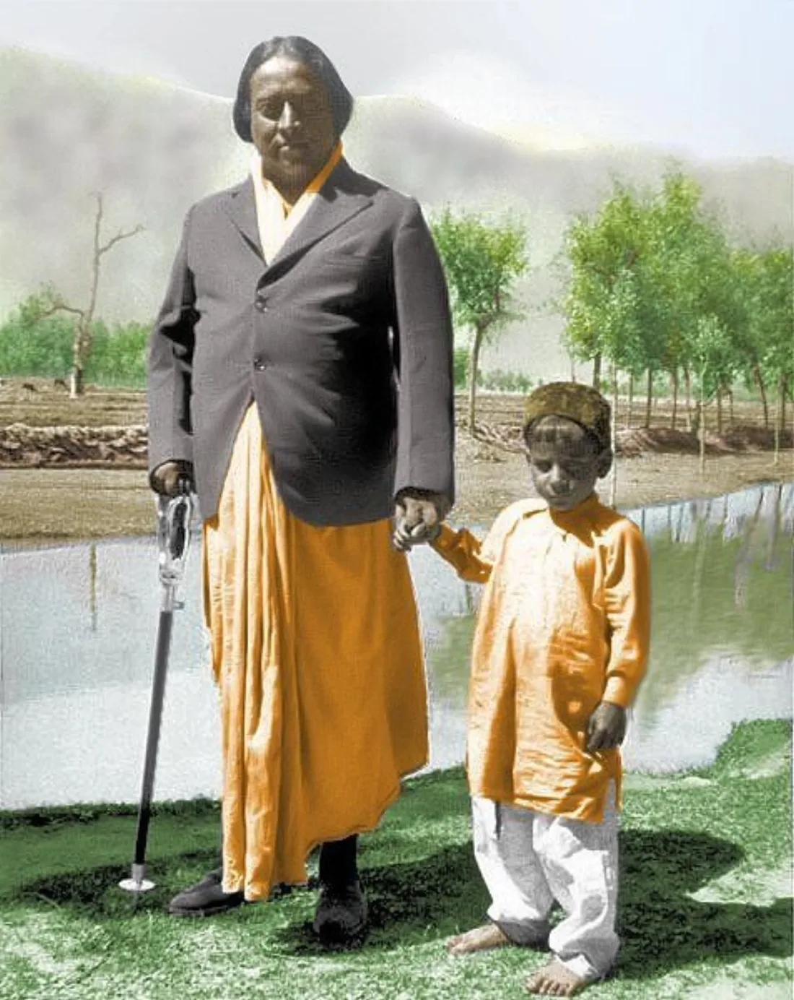

Väl på plats började sökandet inom mig tonas ner. Sakta men säkert växte tydligheten, och jag förstod vikten av att etablera en hälsosam rutin bortom energiarbete och meditation. Styrketräningen blev en viktig pusselbit för balansen – med fokus på kroppen ökade både min närvaro och mitt välmående.

I en svajig och osäker omvärld gick månaderna och tiden rullade på. Sakta men säkert släppte jag livslånga snuttefiltar en efter en, och stod alltmer ensam i mina prioriteringar och rutiner.

Trots det kände jag mig aldrig ensam – mina åtaganden fyllde dagarna med värde och mening. Men känslan av att ha nått en platå växte, och stagnationen smög sig på.

Jag förstod att min djupa önskan om att lära känna mig själv hade tagit mig på en resa djupt ner i undervärlden, in i min inre skugga. Att gräva upp själsligt ogräs med rötterna hade sina konsekvenser. Jag blev jordad, men också tung.

Från magiska, starkt andliga drömmar hade drömmandet blivit mer alldagligt. Flera år av att etablera djupa rötter hade satt sina spår. Fast förankrad insåg jag att de verktyg och tillvägagångssätt som tagit mig hit inte längre kunde bära mig in i nästa fas.

Längtan efter något mer växte sig stark.

Astrologi hade alltid fascinerat mig, och kom in i mitt liv tillsammans med den vediska visdomen från Indien. Äntligen fick jag svar på outtalade frågor, känslor och upplevelser som mitt tidigare sökande inte lyckats besvara.

Tacksam över de nya lärorna och perspektiven fortsatte resan. Med tydlig, handfast och upprepad vägledning ersatte den nya undervisningen mycket av mina tidigare spirituella strukturer.

Med förnyad förståelse, vidgad horisont och en stark känsla av mening började jag ana att något nytt var på väg – att jag stod inför en större expansion.

---

## 18. Resor till Barcelona och Bali

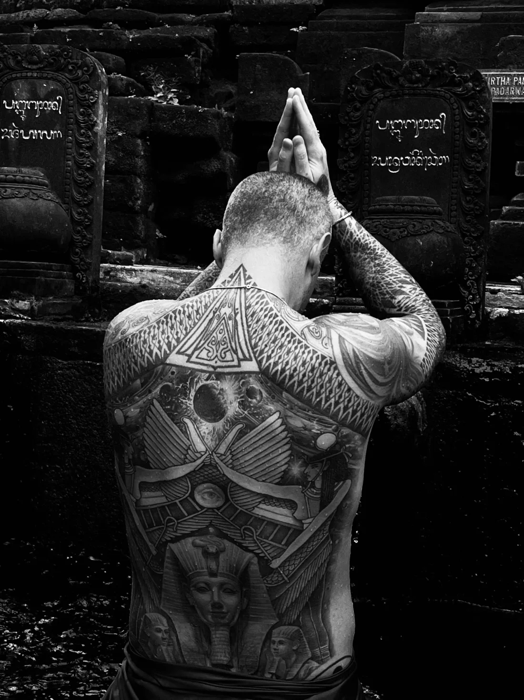
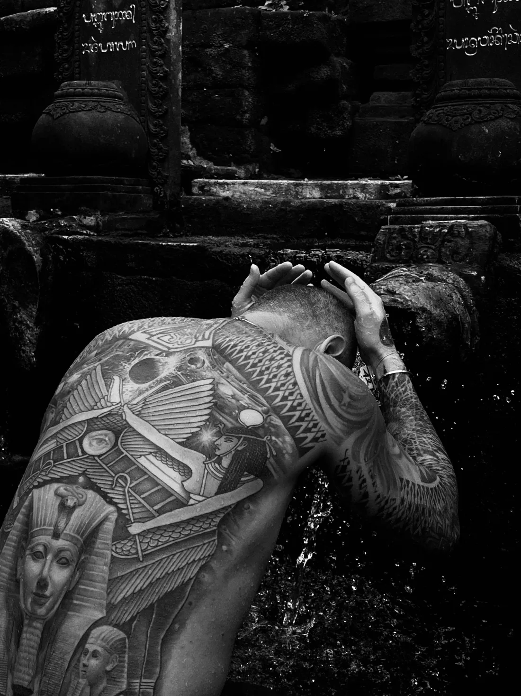

Platsen som hade tjänat mig de senaste åren började kännas begränsad och trång. Jag behövde komma bort för att hitta rätt och få nya perspektiv. Efter flera år utan semester åkte jag en vecka till Barcelona. Med ihållande träning och meditation blev stranden, solen och katedralerna precis vad jag behövde för att få distans och klarhet.

Jag kände mig kallad till Bali och lekte med tanken att flytta dit och ta mitt tatuerande till den lilla ön långt hemifrån. Jag bestämde mig för att åka dit en månad för att känna efter.

Väl på plats blev det tydligt: jag ville inte bo eller arbeta där långsiktigt. Bali var ett fantastiskt ställe att koppla av och ha semester på – men inte mer än så.

Tanken på att fortsätta i de gamla hjulspåren kändes avlägsen, distanserad och uttjänt. Väl hemma i Sverige gick det plötsligt fort – tack vare oväntad hjälp och nyfunnen motivation.

---

## 19. Steget mot egen studio

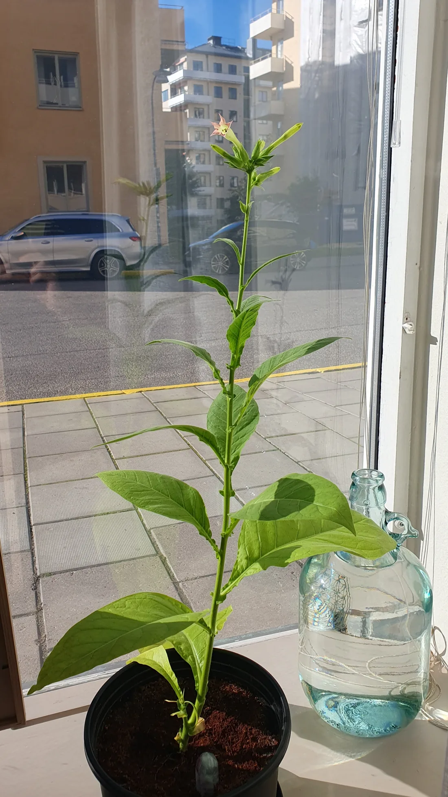

Som en blöt tvål som pressas för hårt och skjuter ur handen sprack min bubbla. Jag förstod genast vad nästa steg var. Det var glasklart – tiden var inne att öppna en egen studio och bryta en cykel av bekvämlighet.

För mig fanns inget kvar, inget att förlora. Det var dags att gå emot strömmen på riktigt och satsa allt, i vissheten om att vara både buren och omhändertagen. Det var dags för min viljestyrka och personliga kraft att möta världens turbulens och osäkerhet.

Med en känsla av att ha funnit det jag alltid sökt öppnade sig världen på nytt.

Jag började direkt arbeta med hemsidan och påbörjade sökandet efter min egen lokal. Med tålamod och en stark vision ställde jag in mig på att parallellt rida ut tiden i den gamla studion.

Starka astrologiska bekräftelser visade mig att mitt engagemang var rätt. Jag hade precis lämnat en cykel och klivit in i en ny. Allting stämde, och beskedet var tydligt – det var dags för mitt eget space, där min dharmiska utveckling skulle ta fart och växa i den nya cykelns påverkan.

Med goda förutsättningar för expansion och en tydlig vision dröjde det inte länge innan den rätta lokalen dök upp. Rätt adress, rätt storlek, rätt läge – det fanns inga tvivel. Platsen var funnen, förstahandskontraktet påskrivet och plötsligt befann jag mig i en ny fas.

Äntligen kunde jag sträcka på mig och röra mig fritt. Tidigare rädslor och tvivel var bortblåsta – all min transformation hade lett mig till just denna punkt. Någonting nytt och vibrerande väntade på att få växa till sig.

---

## 20. Studio ADharma – min plattform

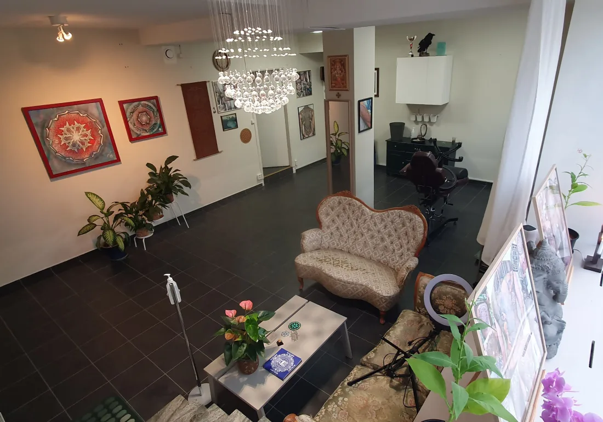

Studio ADharma (Andreas Dharma) är min egen plats – där jag sätter tonen för framtiden och etablerar en miljö utan kompromisser.

Det känns fantastiskt att få skapa och tatuera i en omgivning som speglar mig som person. Här får mina värderingar och visioner utrymme att växa, och här kan jag äntligen blomma och lägga grunden för de kommande åren.

Jag har förstått att jag är här för att arbeta – att göra gott för andra samtidigt som jag hedrar mina drömmar och mitt högre jag. Att utveckla och förfina min moral, finslipa mitt uttryck och mitt skapande, och på så sätt ge tillbaka till världen, fyller mig med mening och ett tydligt syfte.

---

## 21. Framåt

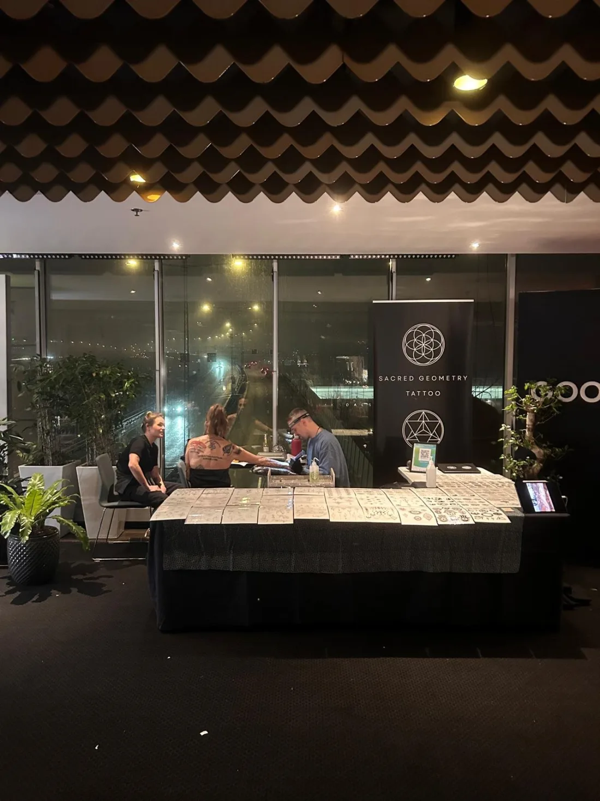

Visionen har funnits med mig länge, men först nu är jag redo att ta steget.

Jag hoppas att få dela min resa med så många som möjligt och att ni ska känna er välkomna och trivas i det utrymme jag skapar.

Den här hemsidan är även en del av den plattform som växer fram för mitt skapande och mitt arbete. Ett digitalt fönster där jag kan nå ut på ett större och mer fokuserat sätt och dela mina gåvor och erfarenheter.

Min resa fortsätter, och jag ser fram emot att få dela den med er som känner er kallade att vara en del av den. Här finns plats för möten, närvaro och nya kapitel.

Varmt välkomna till mitt space, där tatuerandet och konsten blir en mötesplats mellan den inre och den yttre världen.
